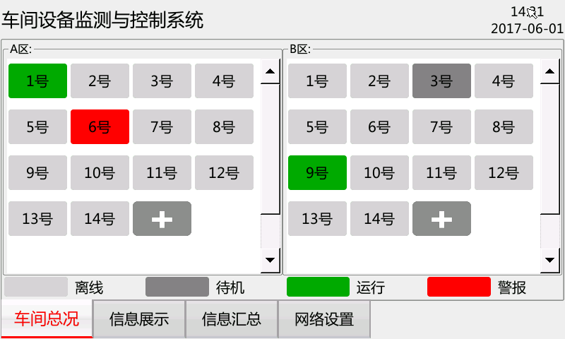

# plantMonitorSys
这是个人本科毕业设计作品的主程序，运行在嵌入式终端，采用C/S通信模式，作为服务器工作，监测和控制车间设备的运行。  
## 功能概述:
本设计推出了一种基于WIFI网络的车间设备监测与控制系统。  
硬件上采用德州仪器公司Cortex-A8架构的ARM处理器作为主控芯片，选用了IAC-335X-Kit开发板进行系统设计，外接USB摄像头模块和WIFI无线模块进行视频采集和数据传输。软件上以嵌入式Linux系统作为软件平台，通过WIFI无线网络技术连接车间的各个设备。将生产数据精确、客观的收集，并对其统计分析，以提升企业的生产管理效率。同时系统使用QT开发上位机软件GUI界面，提供良好的人机交互，供企业管理者对车间设备集中式监测与控制，为打造数字化工厂奠定基础。本设计相较于基于有线网络的监测控制系统，采用WIFI 网络更加便捷、灵活，减小了传统网络布线的实施限制和维护费用，降低了企业的成本投资。  
## 运行截图:
  
  
  
  
  
  
  
  
  
  
  
  
  
## 作者联系方式
**邮箱:justdoit_mqr@163.com**  
**新浪微博:@为-何-而来**  
